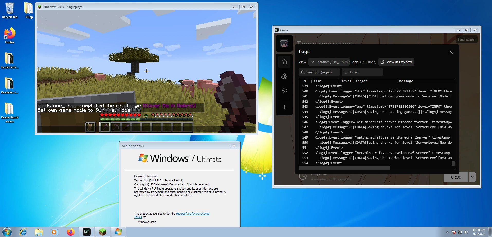

# Launching Kaede in Windows 7

## Screenshot



## Prerequisites

This guide is hopefully written for any Windows 7, but Kaede was tested only in Windows 7 x64 Ultimate Service Pack 1 (build 7601).

Install these necessary updates and runtimes:

- [KB3080149](https://www.microsoft.com/en-us/download/details.aspx?id=48636)
- [Microsoft Visual C++ 2015 Redistributable (x86 and x64)](https://www.microsoft.com/en-us/download/details.aspx?id=52685)
- [Microsoft Visual C++ 2015-2022 Redistributable (x86)](https://aka.ms/vs/17/release/vc_redist.x86.exe)
- [Microsoft Visual C++ 2015-2022 Redistributable (x64)](https://aka.ms/vs/17/release/vc_redist.x64.exe)

I have also installed these updates and runtimes, but they shouldn't be necessary:

- [KB2882822](https://www.microsoft.com/en-us/download/details.aspx?id=40500)
- [KB3033929](https://www.microsoft.com/en-us/download/details.aspx?id=46148)
- [Visual C++ Redistributable Runtimes All-in-One 2005-2013 (both x86 and x64)](https://www.techpowerup.com/download/visual-c-redistributable-runtime-package-all-in-one/). Run `install_all.bat`. I had errors for `vcredist_v14.x64` and `vcredist_v14.x86`, so I guess it is ok if you got errors for them as well.

Also, you probably need to update your root-certificates to avoid TLS certificate verification issues in Minecraft downloads and URL assets fetch. Ask your friend with Windows 10 or something to run in `cmd`:

```shell
certutil -generateSSTFromWU C:\roots.sst
```

Get that `roots.sst` file into `C:\` in your Windows 7 and open powershell (administrator) to run:

```shell
$certs = New-Object Security.Cryptography.X509Certificates.X509Certificate2Collection
$certs.Import("C:\roots.sst")
$store = New-Object Security.Cryptography.X509Certificates.X509Store "Root","LocalMachine"
$store.Open("ReadWrite")
$certs | ForEach-Object { $store.Add($_) }
$store.Close()
Write-Host "Imported $($certs.Count) root certificates"
```

Rebooting is optional for root-certificates update.

## Troubleshooting

> Errors related to `combase.dll` or `icu.dll`

- You shouldn't really see these errors... Make sure you have chose the correct build (should be Windows 7-specific).

> Images don't load or `ERROR | rustls_platform_verifier::verification::windows | failed to verify TLS certificate: invalid peer certificate: UnknownIssuer`

- Update your root-certificates.

> Error related to `ADVAPI32.dll`

- Make sure you have installed the `KB3080149` update.

> Error related to `MSVCP140.dll`

- Make sure you have installed Microsoft Visual C++ 2015 Redistributable (both x86 and x64).

> Error related to `MSVCP140_1.dll`

- Make sure you have installed Microsoft Visual C++ 2015-2022 Redistributable (both x86 and x64)

## Running

Please use a Windows 7-specific build only. Otherwise, you won't be able to execute the launcher.

After extracting the build files (`kaede.exe`, `portable.txt`, possibly a WebView folder, and `txiki-server.exe`) into a folder, simply open `kaede.exe`. You should see a launcher window with no errors.
